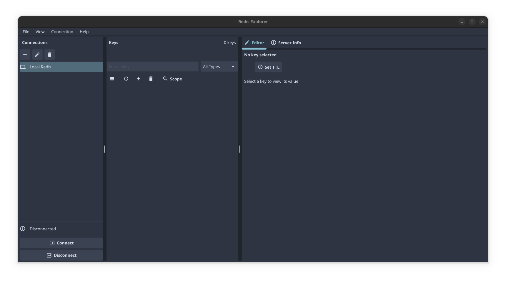
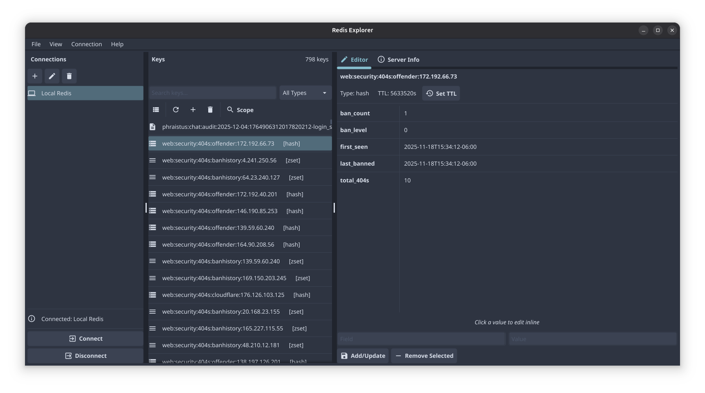
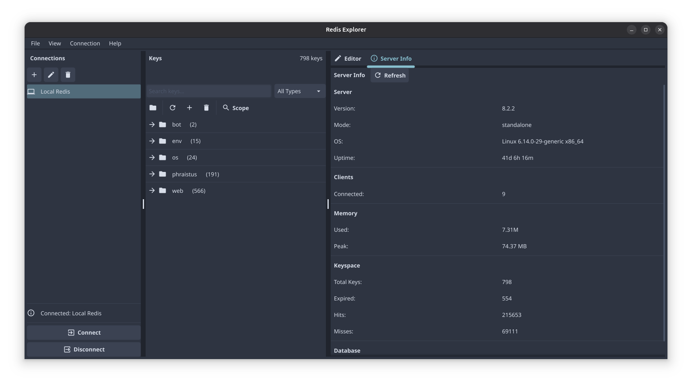
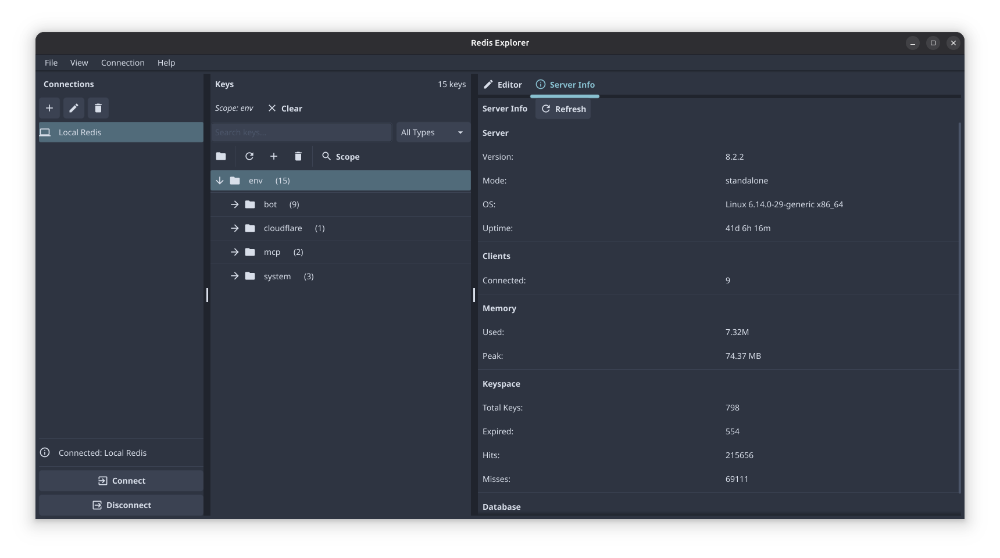
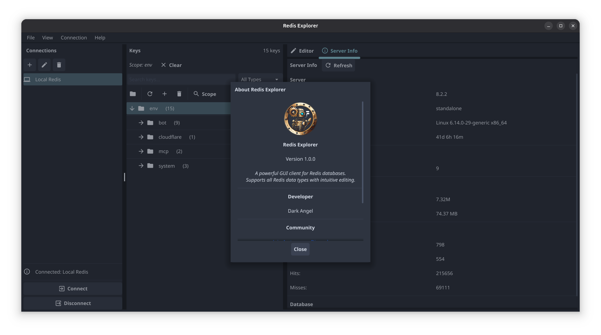

# Redis Explorer

A powerful, cross-platform GUI client for Redis databases built with Go and Fyne.


## Features

- **Connection Management**
  - Multiple server connections with save/load
  - Default localhost:6379 configuration
  - TLS support
  - Database selection (0-15)

- **Key Browser**
  - List view and tree view (directory-style grouping by `:` delimiter)
  - Search and filter keys by pattern
  - Filter by key type (string, list, set, hash, zset, stream)
  - Scope filtering to focus on specific key prefixes
  - Create, rename, and delete keys

- **Value Editor**
  - Full support for all Redis data types:
    - **Strings**: Multi-line text editor with save
    - **Lists**: Add left/right, edit items inline
    - **Sets**: Add/remove members
    - **Hashes**: Field-value table with inline editing
    - **Sorted Sets**: Score-member pairs with inline editing
  - TTL management (view, set, remove expiry)
  - Click-to-edit functionality

- **Server Information**
  - Redis version, mode, OS
  - Memory usage statistics
  - Connected clients
  - Keyspace hits/misses
  - Total keys and expired keys

- **Themes**
  - Dark (default)
  - Light
  - Nord
  - Dracula
  - Solarized

## Installation

### Prerequisites

- Go 1.21 or later
- GCC (for CGO)
- X11 development libraries (Linux)

#### Linux (Ubuntu/Debian)

```bash
sudo apt-get install -y libgl1-mesa-dev xorg-dev
```

#### Linux (Fedora)

```bash
sudo dnf install -y mesa-libGL-devel libXcursor-devel libXrandr-devel libXinerama-devel libXi-devel libXxf86vm-devel
```

### Build from Source

```bash
git clone https://github.com/Viroscope/redis-explorer.git
cd redis-explorer
go build -o redis-explorer .
```

### Run

```bash
./redis-explorer
```

## Usage

1. **Connect to Redis**: Click "Connect" in the sidebar to connect to the default localhost:6379, or add a new connection
2. **Browse Keys**: Use the key browser to navigate your Redis keys in list or tree view
3. **Edit Values**: Click on a key to view/edit its value in the Editor tab
4. **Set Scope**: Select a key or folder and click "Scope" to filter keys by prefix
5. **Server Info**: Switch to the Server Info tab to view Redis server statistics

## Configuration

Settings are stored in:
- **Linux**: `~/.config/redis-explorer/config.json`
- **macOS**: `~/Library/Application Support/redis-explorer/config.json`
- **Windows**: `%APPDATA%\redis-explorer\config.json`

## Project Structure

```
redis-explorer/
├── main.go                 # Application entry point
├── icon.png                # Application icon
├── go.mod / go.sum         # Go modules
└── internal/
    ├── config/
    │   └── config.go       # JSON configuration management
    ├── models/
    │   └── types.go        # Data structures
    ├── redis/
    │   └── client.go       # Redis client wrapper
    └── ui/
        ├── app.go          # Main application window
        ├── theme.go        # Theme definitions
        ├── sidebar.go      # Connection sidebar
        ├── keys.go         # Key browser (list & tree)
        ├── editor.go       # Value editor
        ├── serverinfo.go   # Server statistics
        └── dialogs.go      # Dialog windows
```

## Screenshots

### Main Interface


### Key Browser - List View with Hash Editor


### Tree View with Server Info


### Scope Filtering


### About Dialog


## Contributing

Contributions are welcome! Please feel free to submit a Pull Request.

## Community

Join our Discord community for support and discussions:

[](https://discord.gg/swmy25fFHY)

- **Server**: Arcturus
- **Server ID**: 1122592718544179251

## Author

**Dark Angel**
- Discord User ID: 490662159508832287

## License

This project is open source. See the LICENSE file for details.

## Acknowledgments

- Built with [Fyne](https://fyne.io/) - Cross-platform GUI toolkit for Go
- Redis client powered by [go-redis](https://github.com/redis/go-redis)
